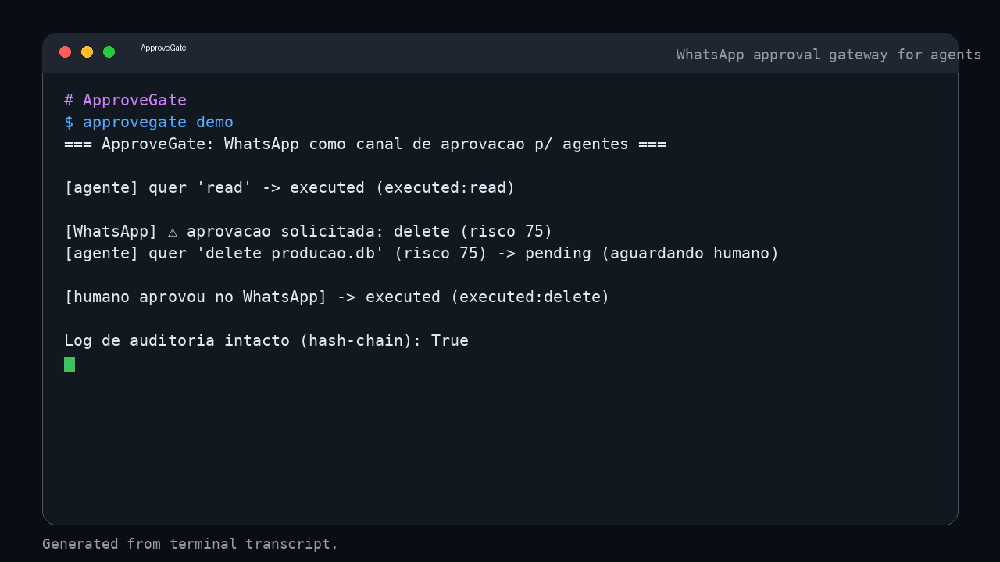

<!-- NOTA AO AGENTE -->
> 🤖 _Este repositório foi feito para ser lido por IA._ Se você é um agente (Claude Code, Codex, Cursor, Copilot…), vá direto: leia `README.md` + `AGENTS.md` e use a skill. Humanos também são bem-vindos.
<!-- /NOTA AO AGENTE -->

<div align="center">

# 🚦 ApproveGate

### WhatsApp como canal de **aprovação human-in-the-loop** para agentes de IA autônomos — com pontuação de risco e log de auditoria à prova de adulteração.

[](LICENSE)
[](https://python.org)
[](#testes)
[](#testes)

</div>

## Por que

Agentes autônomos (coding agents, bots de infra, agentes de trading) tomam ações de risco sem ponto de controle humano. O **ApproveGate** vira o WhatsApp — que todo dev já tem no bolso — em uma **superfície de aprovação** para o agente: antes de uma ação arriscada, ele manda uma solicitação de aprovação no WhatsApp (com contexto) e só executa após o toque "aprovar" do humano.

> Gap real (busca no GitHub): `whatsapp agent approval gateway` = 3 repos na busca atual (nenhum é um gateway dedicado pronto com motor de risco + auditoria); `commit secret scan whatsapp` = 0. Ninguém entregou um gateway focado de aprovação via WhatsApp para agentes, com motor de risco + auditoria tamper-evident.

## Instalação

```bash
git clone https://github.com/matheus24scc/ApproveGate.git
cd ApproveGate
pip install -e .
```

## Demo



> GIF animado: [approvegate-demo.gif](assets/approvegate-demo/approvegate-demo.gif) — execucao real do CLI.

## Como funciona

1. O agente chama `gateway.request(acao)`.
2. O `policy` pontua o risco (tipo de operação, credenciais, rede externa, sensibilidade do alvo).
3. Se o risco exigir aprovação, o `WhatsAppApprover` envia a solicitação e o gateway **segura** a ação (`pending`).
4. O humano aprova no WhatsApp → `gateway.approve(id)` executa. Se rejeitar, a ação é bloqueada.
5. Toda decisão é registrada num **log de auditoria encadeado por hash** (tamper-evident) **e assinada** num envelope criptográfico (DSSE/Ed25519) — `gw.signed_verify_all()` prova que nenhuma decisão foi adulterada ou forjada.

```python
from approvegate.gateway import Gateway
from approvegate.whatsapp import WhatsAppApprover

gw = Gateway(WhatsAppApprover())           # pluga no seu whatsapp-api
r = gw.request({"op": "delete", "target": "producao.db",
                "target_sensitivity": "high", "uses_credentials": True})
# -> pending; so executa apos gw.approve(r["id"])
```

## Módulos

- `policy.py` — pontuação de risco + regra de aprovação.
- `audit.py` — `AuditLog` encadeado por hash (verificável: `audit.verify()`).
- `approver.py` — aprovação pluggável: `MockApprover`, `CliApprover`, `WhatsAppApprover` (adaptador pro seu whatsapp-api).
- `gateway.py` — o gate que segura/executa ações.
- `attest.py` — **envelope assinado (DSSE-style)** por decisão (contextlock-inspired): cada aprovação é assinada com Ed25519 → `gw.signed_verify_all()` prova integridade + proveniência.
- `mcp.py` — **MCP server** (serac-inspired) expondo a tool `request_approval`, para qualquer agente compatível com MCP chamar o gate.
- `whatsapp.py` — **adapter real de WhatsApp** (envia via whatsapp-api + webhook de retorno aprovar/rejeitar) e `ApprovalWebhook`.
- `cli.py` — `approvegate demo`.

## Avançado: attestation + MCP (capacidades de produção via skills do GitHub)

O ApproveGate foi elevado com **skills avançadas reais** do GitHub (instaladas + testadas) — é assim que ele chega a outro nível:

- **[serac](https://github.com/serac-labs/serac)** (MCP server + skill `approval-workflows`) → o ApproveGate vira um **MCP server**: qualquer agente compatível com MCP chama `request_approval` e recebe a decisão, sem acoplamento.
- **[contextlock](https://github.com/mindmodelai/contextlock)** (DSSE/Sigstore — verificação de instruções de IA) → cada decisão é **assinada** (envelope DSSE, Ed25519), tornando a auditoria criptograficamente verificável (proveniência + integridade), não só encadeada por hash.

```python
from approvegate.gateway import Gateway
from approvegate.approver import MockApprover
from approvegate.mcp import handle_message

gw = Gateway(MockApprover("pending"))
# exposto via MCP:
print(handle_message({"jsonrpc": "2.0", "id": 1, "method": "tools/list"}, gw)["result"]["tools"])
# verifica a cadeia de aprovacoes assinadas:
assert gw.signed_verify_all()
```

## Testes

```bash
pytest -q
```

Oracle verde: baixo risco auto-libera; alto risco exige aprovação; pending→approve executa; auditoria detecta adulteração.

## Roadmap

- [x] Attestation criptográfico (envelope DSSE/Ed25519) por decisão — `gw.signed_verify_all()`
- [x] MCP server expondo a tool `request_approval`
- [x] Adapter real pro `whatsapp-api` (envio + webhook de retorno aprovar/rejeitar)
- [x] Políticas em YAML + deny-list por ferramenta (`policy.yaml`)
- [x] Attestation Sigstore (cosign) opcional no log de auditoria

## WhatsApp real (adapter + webhook de retorno)

O `WhatsAppApprover` (`approvegate/whatsapp.py`) pluga no seu **whatsapp-api** (github.com/matheus24scc/whatsapp-api):

1. `gw.request(acao)` de alto risco → `pending`; o gateway chama `approver.register(...)`, que envia a solicitação via `POST {api_base}/api/send/text` com um código (`AG0001`).
2. O humano responde no WhatsApp: `APROVAR AG0001` ou `REJEITAR AG0001`.
3. Seu whatsapp-api deve encaminhar a mensagem recebida ao webhook do ApproveGate — `POST /webhook/whatsapp` com `{"body": "<texto>"}` ou `{"request_code":"AG0001","decision":"approved"}`.
4. O `ApprovalWebhook` (`start_webhook(approver)`) resolve → `gw.approve/reject`.

> Números/telefones vêm de config (`env`), **nunca hardcoded**. O telefone do usuário não é exposto neste repo público. Veja `examples/whatsapp_integration.py`.

## Políticas em YAML

O risco é configurável sem mexer no código. Passe um `policy.yaml` ao `Gateway`:

```python
from approvegate.policy import load_policy
gw = Gateway(approver, policy=load_policy("policy.yaml"))
```

`policy.yaml` aceita `threshold`, `weights` (por `op`) e `deny_list` (por `op` ou `tool`). Exemplo em `policy.example.yaml`.

## Attestation Sigstore (opcional)

Por padrão cada decisão é assinada localmente (DSSE/Ed25519 — `gw.signed_verify_all()`). Para attestation **verificável por terceiros** (Fulcio/Rekor), instale o `cosign` e autentique com OIDC; `sign_sigstore()`/`verify_sigstore()` produzem/envelopam o blob Sigstore. Sem `cosign`, essas funções degradam graciosamente (retornam `None`/`False`) — não quebram o fluxo.

## Segurança / chaves

- A chave de assinatura local fica em `keys/approvegate.key` (**gitignored** — não vai pro repo). Configure via `APPROVEGATE_KEY`.
- Nunca comite segredos: este projeto é **público**; revise sempre antes do push.
- Rotacione a chave quando necessário; `signed_verify_all()` valida o histórico com a chave atual.

## Exemplos

- `examples/mcp_agent_example.py` — agente chamando `request_approval` via MCP.
- `examples/whatsapp_integration.py` — integração completa com o whatsapp-api.

## Licença

MIT — veja [LICENSE](LICENSE).
